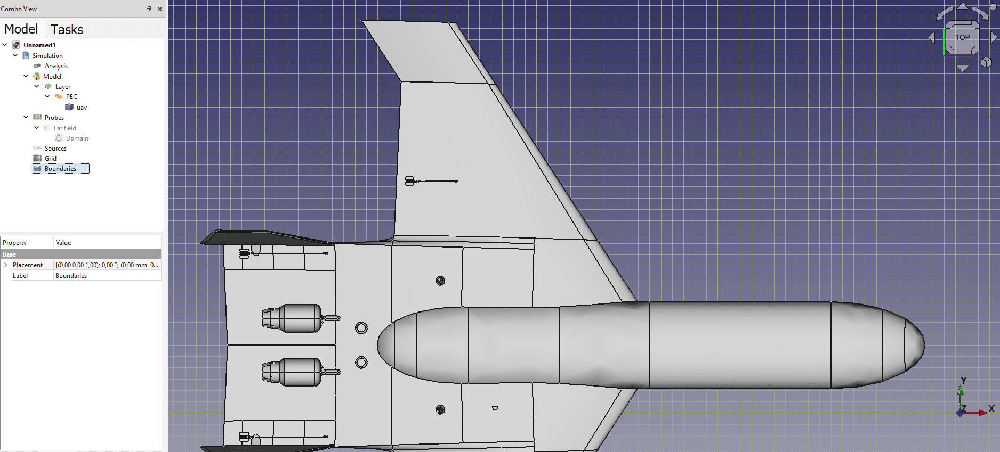
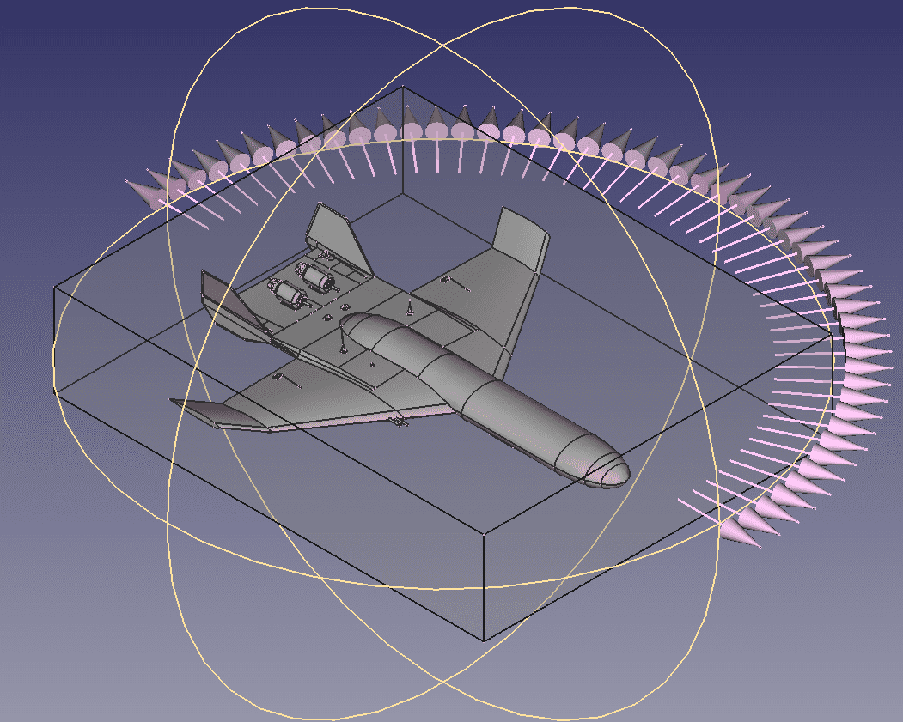

---
sidebar:
nav: "docs"
permalink: /index.html
layout: splash
intro:
  - excerpt: "Home"
---


<link rel="stylesheet" href="./assets/css/prev-projects.css">

  <h1 class="subtitle">Services</h1>
  

    <h2> Computational Electromagnetics </h2>
    
 Elemwave specializes in computational electromagnetics, translating the physical problem into a software solution. We can develop custom solutions for highly demanding problems in which traditional commercial software fails. We can also facilitate the integration of existing software tools into CAD software, facilitating its use and reducing the training required by engineers.

  

  

    <h2> EM, EMC & RF Engineering </h2>
    
 We provide solutions for electromagnetic (EM), electromagnetic compatibility (EMC), and radiofrequency (RF) problems. We perform a holistic approach which deviates from standard specialized solutions. This includes the identification of the relevant parameters, the modeling of the problem, and proposing solutions to overcome them.

  

  <h1 class="subtitle">Previous Projects</h1>
  

    <h2 name="project1">Elemwave's workbench</h2>
    
The 3D-FDTD workbench is a <a href="https://www.freecad.org/" target="_blank">FreeCAD</a> plugin which can be used to define electromagnetic problems based on the finite differences in time domain (FDTD) method.
    While it currently integrates meshers and <a href="https://github.com/opensemba/fdtd" target="_blank">electromagnetic solvers</a> from <a href="https://github.com/opensemba" target="_blank">OpenSEMBA</a> and privative solvers developed by <a href="https://www.airbus.com/en" target="_blank">Airbus</a>, the tool can also be extended to include other solvers and has scripting capabilities to automatize some procedures.
    

    

        
         
        
 View of a grid definition for an FDTD problem.

         
        
         
        
 View of a far field request definition for an FDTD problem.

    

  

    

    <h2 name="project1">Integrating circuits in complex geometries</h2>
    
 The workbench can integrate <a href="https://en.wikipedia.org/wiki/SPICE" target="_blank">SPICE circuits</a> and <a href="https://github.com/OpenSEMBA/mtln" target="_blank"> MTLN (multiconductor transmission line networks)</a> into full-wave 3D FDTD simulations.
    The process covers the cross-section definition of an MTL to extract its per unit length parameters through <a href="https://github.com/OpenSEMBA/pulmtln" target="_blank">OpenSEMBA pulmtln</a>; integrating the native <a href="https://www.freecad.org/" target="_blank">FreeCAD</a> mesher and <a href="https://gmsh.info/" target="_blank">gmsh</a>, the <a href="https://mfem.org/" target="_blank">MFEM finite element solvers library</a>, and allowing visualizations with <a href="https://www.paraview.org/" target="_blank">Paraview</a>.
    

    

        
         
        
Elemwave's workbench allows for modelling typical EMC problems which involve the interaction between lumped circuits, cable bundles, and geometry.

         
         
         
        
 Cable bundle's cross sections can be with arbitrary shapes can be defined, solved, and evaluated to determine the coupling between the different conductors.

    

  

  

    <h2 name="project2">Hecate project</h2>
    
The <a href="https://hecate-project.eu" target="_blank">HECATE project</a> is a European project which aims to develop high voltage electric power distribution technologies. It is being led by Collins Aerospace technologies and participated by more than 20 partners in the rest of europe which include Airbus, Safran, and NLR.
    Elemwave is developing the graphical user interface to facilitate the problem definition in EMC problems which involve cable bundles.

  

