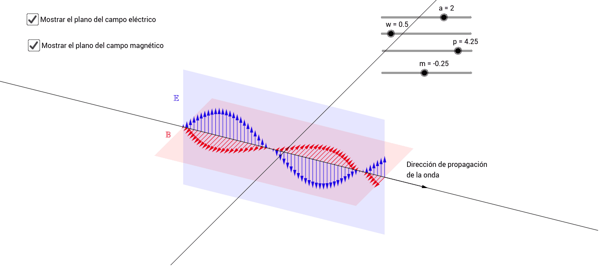

---
sidebar:
nav: "docs"
permalink: /previous-projects.html
layout: splash
header:  
    video: /assets/images/waves.mp4
    overlay_color: "rgba(63, 108, 152, 1)"
intro:
  - excerpt: "Previous projects"
---



<link rel="stylesheet" href="./assets/previousprojects.css">

Here we can put a little introducion.Here we can put a little introducion.Here we can put a little introducion.Here we can put a little introducion.Here we can put a little introducion.Here we can put a little introducion.Here we can put a little introducion.Here we can put a little introducion.Here we can put a little introducion.Here we can put a little introducion.Here we can put a little introducion.

  <h2 name="project1">Project Number 1</h2>
  

  
This text is an example of what it will look like when we put the information of the project in question here This text is an example of what it will look like when we put the information of the project in question here This text is an example of what it will look like when we put the information of the project in question here This text is an example of what it will look like when we put the information of the project in question here This text is an example of what it will look like when we put the information of the project in question here This text is an example of what it will look like when we put the information of the project in question here.
  

  <figure>
    
    <figcaption class="img-cap"> Some information about the photograph of the project</figcaption>
  </figure>

<h2 name="project2">Project Number 2</h2>
  

    
This text is an example of what it will look like when we put the information of the project in question here This text is an example of what it will look like when we put the information of the project in question here This text is an example of what it will look like when we put the information of the project in question here This text is an example of what it will look like when we put the information of the project in question here This text is an example of what it will look like when we put the information of the project in question here This text is an example of what it will look like when we put the information of the project in question here.

  <figure>
    
    <figcaption class="img-cap"> Some information about the photograph of the project</figcaption>
  </figure>

