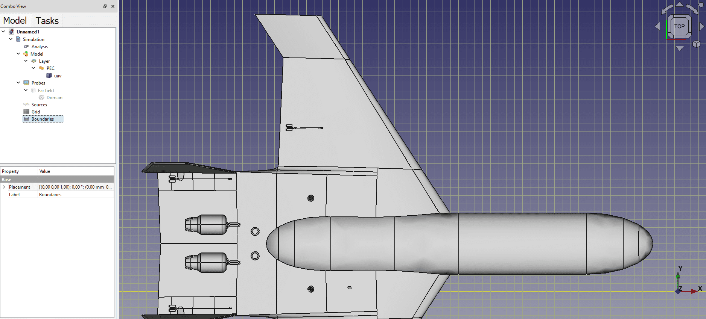
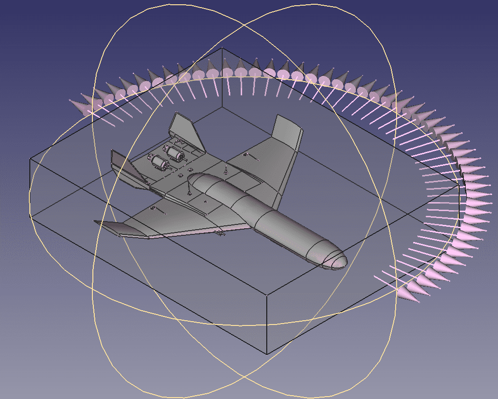

---
sidebar:
nav: "docs"
permalink: /previous-projects.html
layout: splash
header:  
    video: /assets/images/waves.mp4
    overlay_color: "rgba(63, 108, 152, 1)"
intro:
  - excerpt: "Previous projects"
---


<link rel="stylesheet" href="./assets/css/prev-projects.css">

  

    <h2 name="project1">Elemwave workbench</h2>
    
Elemwave has developed a propietary tool, the workbench, to help with the definition of electromagnetic problems. Currently it integrates a CAD program, meshers, and different solvers. The tool can be easily extended to include other solvers and has scripting capabilities to automatize some procedures.
    

    

        
         
        
 View of a grid definition for an FDTD problem.

         
        
         
        
 View of a far field request definition for an FDTD problem.

    

  

  

    <h2 name="project2">Hecate project</h2>
    
The <a href="https://hecate-project.eu" target="_blank">HECATE project</a> is a European project which aims to develop high voltage electric power distribution technologies. It is being led by Collins Aerospace technologies and participated by more than 20 partners in the rest of europe which include Airbus, Safran, and NLR.
    Elemwave is developing the graphical user interface to facilitate the problem definition in EMC problems which involve cable bundles.

  

